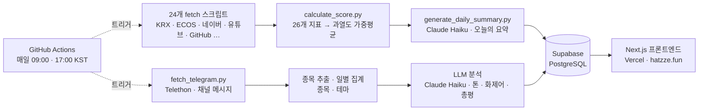

# hatzze | 데이터와 감성으로 읽는 시장

시장·감성 지표 **26개**를 매일 종합해 지금 코스피가 얼마나 달아올랐는지를 하나의 **온도**(℃)로 보여주고, 주식 텔레그램에서 무엇이 회자되는지를 **카더라 리포트**로 정리하는 대시보드입니다.

🔗 **[hatzze.fun](https://hatzze.fun)**

> ⚠️ 햇쩨 지수의 저온·상온·고온·초고온 구간과 카더라 리포트의 집계는 시장의 **과열 정도**와 **회자되는 정도**를 나타낸 표현일 뿐, **재미·참고용이며 매수·매도 신호가 아닙니다.**

---

## 햇쩨 지수 (`/`)

26개 지표의 과열도를 가중 평균해 `0~100`을 시장 온도 `℃`로 표시합니다.

| 구간 | 점수 | 의미 |
|---|---|---|
| ❄️ 저온 | `0–24` | 시장이 차분·위축 |
| 🌡️ 상온 | `25–49` | 평범 |
| 🔥 고온 | `50–74` | 달아오르는 중 |
| 🌋 초고온 | `75–100` | 과열 |

그 밖에:

- **오늘의 요약** — 매일 그날의 데이터를 **Claude Haiku**가 3문단으로 브리핑합니다. (① 기준선을 넘은 지표 수 + 현재 구간 ② 오늘 가장 뜨거운 지표와 그 의미 ③ 최근 며칠 추세)
- **지표 카드 26장** — 지표별 과열도·실제 값·30일 추이·인포그래픽.
- **상단 시세 티커** — 코스피·코스닥·주요 종목·환율·비트코인 (10분 갱신).

---

## 카더라 리포트 (`/kadera`)

주식·재테크 **텔레그램 채널**의 공개 메시지를 매일 수집해, 지금 그 바닥에서 무엇이 회자되는지를 9개 카드로 정리합니다. 이름은 '카더라'(찌라시)에서 따왔습니다.

| 카드 | 보여주는 것 |
|---|---|
| 모니터링 현황 | 추적 중인 채널 규모 |
| 텔레그램 생태계 센티먼트 | 메시지 톤으로 본 시장 분위기 |
| 급부상 종목 | 평소보다 언급이 갑자기 뛴 종목 |
| 트렌딩 메시지 | 조회·공유로 가장 널리 퍼진 메시지 (오늘/7일/30일) |
| 테마 로테이션 | 관심이 어느 테마로 옮겨가는지 |
| 주요 종목 리포트 | 가장 많이 회자된 종목의 추이와 흐름 |
| 채널 파워 랭킹 | 조회율·확산력까지 반영한 채널 영향력 점수 |
| 뜨는 채널 | 최근 구독자가 많이 늘어난 채널 |
| 이슈 키워드 | 종목명이 아닌 화제어 |

수집은 **Telethon**(Telegram Client API), 종목 추출은 **KRX 상장 2,700여 종목 사전 + 별칭 매칭**, 메시지 톤·화제어 분류와 총평 작성은 **Claude Haiku**가 맡습니다. 모니터링 채널 목록은 레포에 두지 않고 Supabase에서 런타임 조회합니다.

집계에서 지키는 두 가지:

- **절대량이 아니라 점유율(share)로 비교합니다.** 주말엔 전체 메시지가 평일의 1/10로 떨어져, 절대 언급 수로 증감을 재면 모든 항목이 일제히 ▼로 나옵니다.
- **하루치끼리 비교하지 않습니다.** 최근 3일 평균 vs 그 이전 평균으로 봐야 메시지가 얇은 날의 요동이 가라앉습니다.

---

## 아키텍처



**파이프라인이 계산하고, 프론트는 읽기만 합니다.** 지표 수집·점수 계산·요약 생성과 텔레그램 수집·분석은 GitHub Actions가 하루 2회(오전 9시 주 실행 + 오후 5시 실패 만회) 돌려 Supabase에 저장하고, Next.js는 매 요청마다 Supabase에서 최신 값을 읽어 렌더합니다.

서버 함수는 `vercel.json`의 `regions: ["icn1"]`로 **서울에 고정**돼 있습니다 — 지우지 마세요. Supabase가 `ap-northeast-2`(서울)라 기본값인 `iad1`(미국)을 쓰면 렌더 중 쿼리마다 태평양을 왕복해 페이지가 몇 초씩 느려집니다.

---

## 폴더 구조

```
hatzze/
├─ app/                     # Next.js(App Router) 프론트엔드
│  ├─ page.tsx              #   메인 대시보드(히어로 지수 + 지표 카드)
│  ├─ kadera/               #   카더라 리포트(텔레그램 분석)
│  ├─ AppShell.tsx          #   상단 티커·네비·다크모드 셸
│  └─ api/ticker/           #   실시간 시세 티커 API
├─ lib/                     # Supabase 조회·포맷 유틸(server-only)
├─ data-pipeline/           # Python 배치 파이프라인
│  ├─ scripts/              #   지표별 fetch_*.py · calculate_*.py · generate_*.py · 텔레그램 수집·분석
│  ├─ config/               #   지표 임계값·가중치 · 종목 별칭 · 테마 사전
│  └─ common/               #   Supabase 클라이언트·공용 유틸
├─ supabase/                # 스키마 + 마이그레이션 SQL
└─ .github/workflows/       # daily-update.yml (일일 자동 실행)
```

---

## 지표 (26개)

<details>
<summary><b>시장 지표 (15개)</b> — 가격·수급·변동성 등 시장 데이터</summary>

- 코스피 신고가 대비 괴리율
- 버핏지수 (시가총액 / GDP)
- 코스피 거래대금 급증도
- VKOSPI (변동성지수)
- 금 대비 코스피 상대강도
- 원/달러 환율 변동성
- 코스피 대비 코스닥 상대강도
- 레버리지 ETF·선물 미결제약정 종합 지수
- 아시아 3국(일본·홍콩·대만) 대비 코스피 상대강도
- 최근 한 달 매매 안전장치 동향 (사이드카·서킷브레이커)
- VIX 대비 VKOSPI 스프레드
- 개인 순매수 강도
- 옵션 풋/콜 비율
- 투자자예탁금
- 거래대금 쏠림도 (상위10 종목 비중)

</details>

<details>
<summary><b>감성 지표 (11개)</b> — 검색·커뮤니티·소비 등 대중 심리</summary>

- 주식 초보 검색량 지수
- 디씨 주식 갤러리 감성 지수
- 경제뉴스 헤드라인 감성 지수
- 경제·재테크 도서 베스트셀러 비중
- 재테크 유튜브 검색 콘텐츠 조회수
- 명품·수입차 소비 검색 지수
- 오마카세·파인다이닝 웨이팅 검색 지수
- 실물–증시 괴리 지수
- 업비트 투기 과열 지수
- 깃헙 트레이딩봇 저장소 생성 수
- 증권 앱 인기차트 순위

</details>

---

## 기술 스택

| | |
|---|---|
| **프론트엔드** | Next.js 16 (App Router) · React 19 · TypeScript · Tailwind CSS 4 · Pretendard |
| **데이터 파이프라인** | Python 3.11 · Supabase Python SDK · Anthropic SDK (Claude Haiku) · Telethon |
| **데이터베이스** | Supabase (PostgreSQL, RLS) |
| **자동화·배포** | GitHub Actions (일일 배치) · Vercel (프론트) |

---

## 로컬 개발

### 프론트엔드

```bash
npm install
npm run dev          # http://localhost:3000
```

### 데이터 파이프라인

```bash
cd data-pipeline
python -m venv .venv && source .venv/bin/activate
pip install -r requirements.txt

python scripts/calculate_score.py          # 지표 종합 점수 계산
python scripts/generate_daily_summary.py   # 오늘의 요약 생성

python scripts/fetch_telegram.py           # 카더라: 채널 메시지 수집
python scripts/extract_telegram_stocks.py  # 카더라: 메시지에서 종목 추출
```

텔레그램 스크립트는 세션이 먼저 필요합니다. `my.telegram.org`에서 `api_id`/`api_hash`를 발급받고 `python scripts/generate_telegram_session.py`로 한 번 로그인해 세션 문자열을 얻으세요. **세션은 계정 로그인 권한이라 절대 커밋하면 안 됩니다.**

---

## 환경변수

`.env.example`을 복사해 `.env.local`에 키를 채웁니다.

```bash
cp .env.example .env.local
```

| 변수 | 용도 |
|---|---|
| `SUPABASE_URL` / `SUPABASE_PUBLISHABLE_KEY` | 프론트엔드 읽기용 |
| `SUPABASE_SECRET_KEY` | 파이프라인 쓰기용 + 카더라 리포트 조회용 |
| `KRX_API_KEY` | 코스피 시세·신고가·시총·VKOSPI 등 |
| `ECOS_API_KEY` | 한국은행 GDP (버핏지수) |
| `NAVER_CLIENT_ID` / `NAVER_CLIENT_SECRET` | 네이버 데이터랩·종목토론방 |
| `YOUTUBE_API_KEY` | 유튜브 재테크 콘텐츠 |
| `ALADIN_TTB_KEY` | 알라딘 베스트셀러 |
| `ANTHROPIC_API_KEY` | 오늘의 요약 · 카더라 리포트 LLM 분석(Claude Haiku) |
| `GITHUB_TOKEN` | 깃헙 검색 API (선택 — 없으면 비인증) |
| `TELEGRAM_API_ID` / `TELEGRAM_API_HASH` / `TELEGRAM_SESSION` | 카더라 리포트 메시지 수집 |
| `TELEGRAM_CHANNELS_SHEET_ID` | 모니터링 채널 목록 시트 |

---

## 자동화 (GitHub Actions)

`.github/workflows/daily-update.yml`이 매일 두 번 파이프라인을 실행합니다.

- **09:00 KST** — 주 실행 (장 시작 후)
- **17:00 KST** — 실패 시 자동 만회하는 재실행

지표 수집·점수 계산에 이어 카더라 리포트 파이프라인(채널 동기화 → 메시지 수집 → 영향력 점수 → 종목 추출 → 종목·테마 집계 → LLM 분류 → 총평 생성)이 같은 워크플로우에서 돕니다.

각 스텝은 `continue-on-error`로 개별 실패가 전체를 막지 않으며, 실패가 있으면 알림 이슈를 열어 추적합니다.

---

## Supabase 스키마

`supabase/schema.sql`을 Supabase SQL Editor에 붙여넣어 실행하면 `indicators`, `indicator_values`, `daily_score` 3개 테이블과 RLS(공개 읽기 전용·쓰기는 service_role)가 설정됩니다. 이후 스키마 변경은 `supabase/migration_*.sql` 파일로 관리합니다.

카더라 리포트용 `telegram_*` 테이블은 공개 읽기를 열지 않아서, 프론트도 `SUPABASE_SECRET_KEY`로 조회합니다.

---

## 데이터 출처

KRX 정보데이터시스템 · 한국은행 ECOS · 네이버 데이터랩/오픈API · YouTube Data API · 알라딘 · GitHub Search API · Apple App Store · DCInside · Upbit · Yahoo Finance · Telegram(공개 채널)
